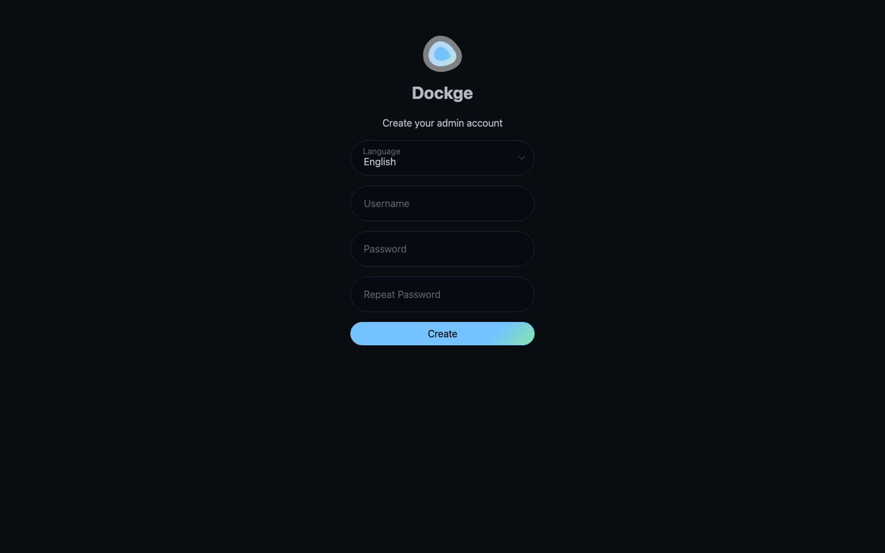

Nexlayer.com
#62 https://github.com/armondhonore/dockge

LIVE URL: https://relaxed-weasel-dockge.cloud.nexlayer.ai

A gorgeous UI for managing Docker Compose stacks, from the maker of Uptime Kuma. Dockge makes editing compose files feel modern — reactive, clean, fast. Single container, instant container ops.

#250apps #nexlayer #docker #devops #opensource

